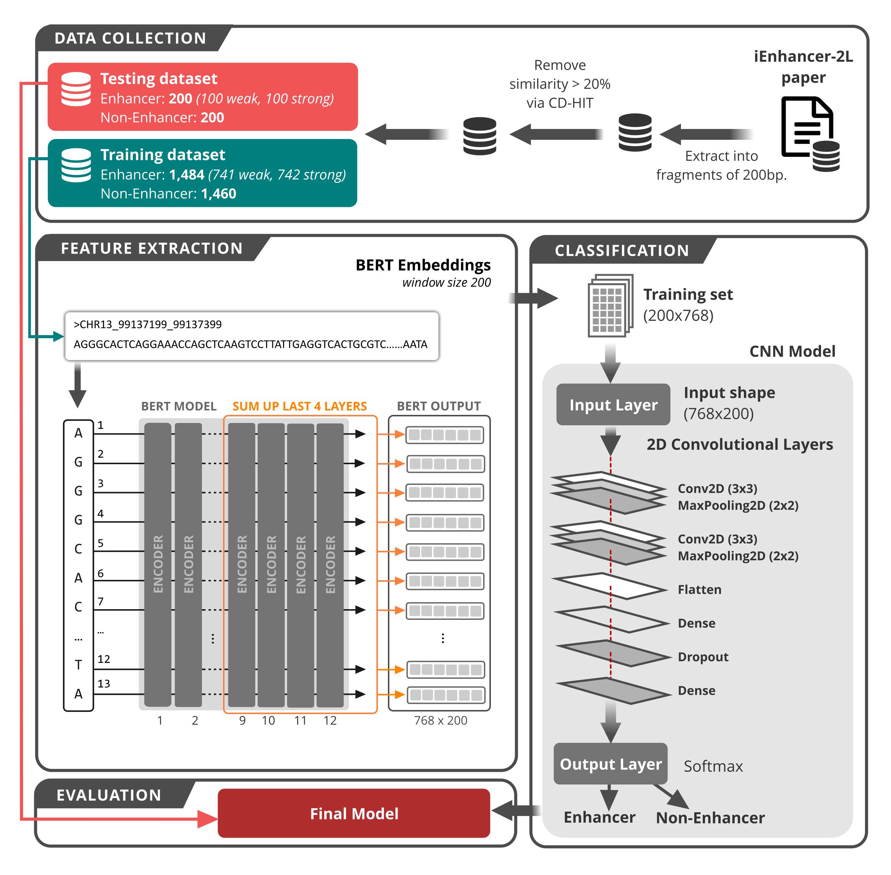

# Bert-Enhancer
A transformer architecture based on BERT and 2D convolutional neural network to identify DNA enhancers from sequence information

Recently, language representation models have drawn a lot of attention in the natural language processing field due to their remarkable results. Among them, bidirectional encoder representations from transformers (BERT) has proven to be a simple, yet powerful language model that achieved novel state-of-the-art performance. BERT adopted the concept of contextualized word embedding to capture the semantics and context of the words in which they appeared. In this study, we present a novel technique by incorporating BERT-based multilingual model in bioinformatics to represent the information of DNA sequences. We treated DNA sequences as natural sentences and then used BERT models to transform them into fixed-length numerical matrices. As a case study, we applied our method to DNA enhancer prediction, which is a well-known and challenging problem in this field. We then observed that our BERT-based features improved more than 5–10% in terms of sensitivity, specificity, accuracy and Matthews correlation coefficient compared to the current state-of-the-art features in bioinformatics. Moreover, advanced experiments show that deep learning (as represented by 2D convolutional neural networks; CNN) holds potential in learning BERT features better than other traditional machine learning techniques. In conclusion, we suggest that BERT and 2D CNNs could open a new avenue in biological modeling using sequence information.

## Step by step for training model
### Dependencies
- Python 3
- Tensorflow 1.x: https://www.tensorflow.org/
- BERT: https://github.com/google-research/bert

### Prediction step-by-step:
### Step 1
Use "extract_seq.py" file to generate JSON files
- *python extract_seq.py*

### Step 2
Use command line in "bert2json.txt" to train BERT model and extract features

### Step 3
Use "jsonl2csv.py" to transfrom JSON to CSV files:
- *python jsonl2csv.py json_file csv_file*

### Step 4
Use "2D_CNN.py" to train 2D CNN model from generated CSV files

## Citation
Please cite our paper as:
>Le NQK, Ho QT, Nguyen TTD, and Ou YY (2021) A Transformer Architecture Based on BERT and 2D Convolutional Neural Network to Identify DNA Enhancers from Sequence Information. *Briefings in Bioinformatics.* https://doi.org/10.1093/bib/bbab005.
